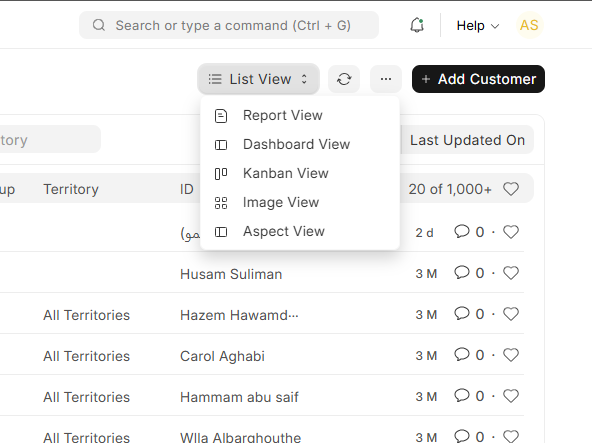
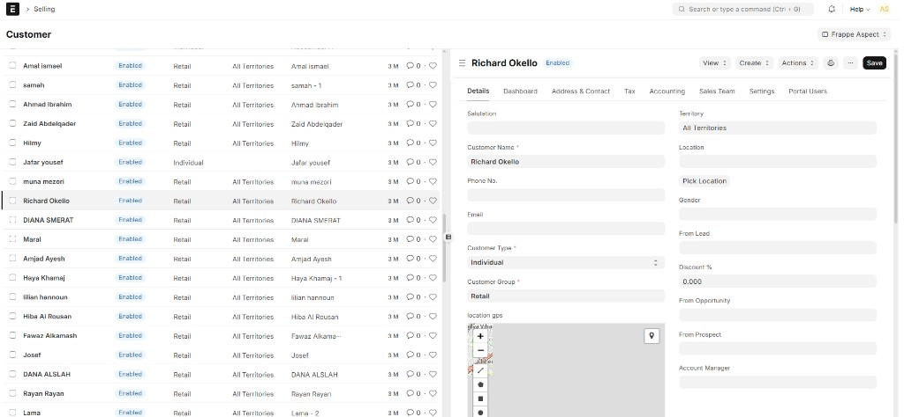

## Frappe Aspect

## Overview

Frappe Aspect adds a resizable split-screen workspace for ERPNext and Frappe — a list on one side and an editable form on the other — so you can browse and edit records without switching pages.

## Screenshots

Open **Aspect View** from the list view menu on any DocType:

Browse records and edit details side by side in one screen:

## Features

Split-Screen Interface: Displays a list of records on one side and the detailed form view of the selected record on the other side.

Seamless Navigation: Users can click on any record in the list view to load its details in the form view instantly.

Editable Form View: The form view is fully editable, allowing users to make changes and save them without leaving the split-screen interface.

Customizable Layout: Users can adjust the split ratio between the list view and form view to suit their preferences.

Enhanced Productivity: By reducing the need to switch screens, the app helps users work more efficiently and reduces cognitive load.

Search and Filter: Standard Frappe list filters and sorting are available in the list pane.

Easy to Use: Switch between Aspect View and the normal list view in a single click.

## License

MIT
